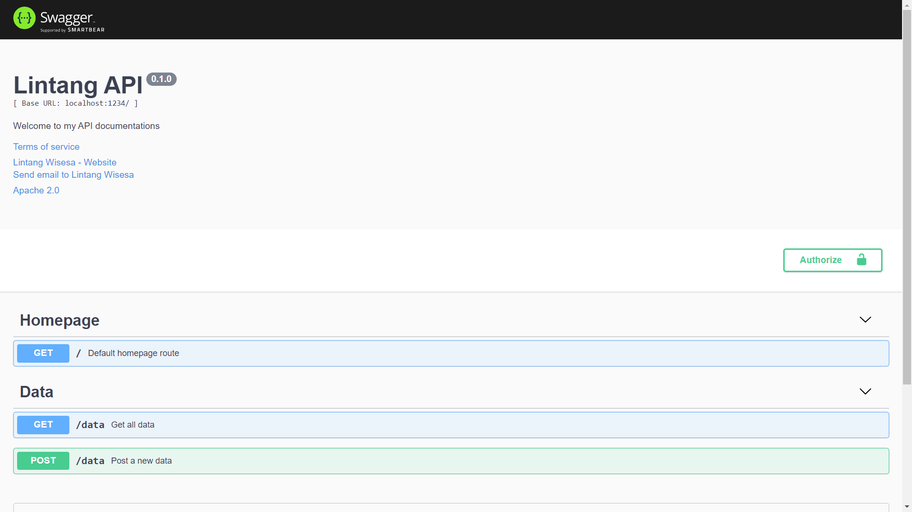
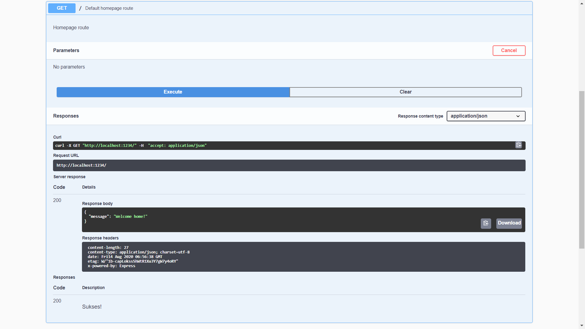
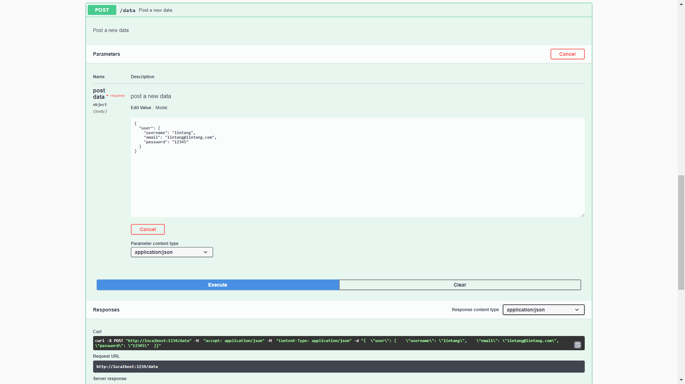

# Swagger Docs for Node.js (Express.js) app

1. Initialize ```node.js``` (```express.js```) application.

    ```bash
    $ mkdir yourAppName

    $ cd yourAppName
    
    $ npm init

    $ npm i express cors
    ```

2. Create a simple ```app.js``` file with several routes.

    ```javascript
    const express = require('express')
    const app = express()
    app.use(express.json())

    // Home default route
    app.get('/', (req, res)=>{
    res.status(200).json({
        message: 'Welcome home!'
        })
    })

    // GET /data return: array of students
    app.get('/data', (req, res)=>{
        res.status(200).json({
            students: [
                {name: 'Andi', age: 12},
                {name: 'Budi', age: 13},
                {name: 'Caca', age: 14}
            ]
        })
    })

    // POST /data return status & body request
    app.post('/data', (req, res)=>{
        res.status(200).json({
            status: 'POST to /data',
            body: req.body
        })
    })

    // server
    app.listen(1234, ()=>{
        console.log('Server is running on port 1234')
    })
    ```

3. To create ```swagger``` documentation, first install ```swagger-jsdoc``` and ```swagger-ui-express```.

    ```bash
    $ npm i swagger-jsdoc swagger-ui-express
    ```

4. Setup ```swagger-jsdoc``` and ```swagger-ui-express``` on ```app.js```, insert line below (before your routes).

    ```javascript
    const swaggerJsdoc = require('swagger-jsdoc')
    const swaggerUi = require('swagger-ui-express')

    // swagger options
    const swaggerOptions = {
        swaggerDefinition: {
            info: {
                title: "Lintang API",
                description: "Welcome to my API documentations",
                termsOfService: "http://zipay.id",
                contact: {
                    name: "Lintang Wisesa",
                    url: "bit.ly/linbio",
                    email: "lintangwisesa@ymail.com"
                },
                license: {
                    name: "Apache 2.0",
                    url: "https://www.apache.org/licenses/LICENSE-2.0.html"
                },
                version: "0.1.0",
                server: {
                    url: "http://localhost:1234",
                    description: "Development server"
                }
            },
            host: 'localhost:1234',
            basePath: '/'                   // api base URL
        },
        apis: ['./docs/**/*.yaml'],         // path to .yaml
    }

    // swagger UI setup
    const swaggerDocs = swaggerJsdoc(swaggerOptions)
    app.use('/docs', swaggerUi.serve, swaggerUi.setup(swaggerDocs))
    ```

5. Create all route documentations using ```yaml``` inside ```docs``` directory. The ```yaml``` format example is shown below.

    ```yaml
    paths:
        /:
            get:
            tags:
                - Homepage
            summary: Default homepage route
            produces:
            - application/json
            description: Homepage route
            responses:
                '200':
                    description: 'Sukses!'
    ```

6. Run ```app.js``` then the Swagger docs page can be accessed on your ```http://localhost:1234/docs```.

    - Documentation page

        

    - GET section

        

    - POST section

        

    Enjoy ~ 😎

<hr>

#### Lintang Wisesa :love_letter: _lintangwisesa@ymail.com_

[Facebook](https://www.facebook.com/lintangbagus) | 
[Twitter](https://twitter.com/Lintang_Wisesa) |
[Youtube](https://www.youtube.com/user/lintangbagus) |
[LinkedIn](https://www.linkedin.com/in/lintangwisesa/) | 
:octocat: [GitHub](https://github.com/LintangWisesa) |
[Hackster](https://www.hackster.io/lintangwisesa)